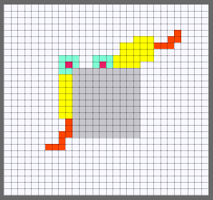

# cells-attract

#### Web-based depiction of "cell"-like creatures attracted to one another

*Latest version: v1.0*

* ##### Two cells with congruent attraction behavior toward each other, triggered by arrow keys
    * The left, right, and up arrow keys start top-right cell (cell A) only, and the down arrow key starts both cells A & B. All motion is automatic, and the direction of the arrow key has no impact on the direction in which the cell chooses to walk.
    * Iterative presses increases the speed of the attraction (watch out!)
    * The cells leave "trails" behind them (yellow) representing their memory of recently visited areas, and they are less prone to walk to squares they have reacently visited (this can cause the cells to get stuck if they are surrounded by obstacles and yellow trail -- they are not very smart). 
    * There is a second trail (orange), which actually represents places where the opposing cell has focused (opposing cells have a second "sense" of where there counterparts were, and it is this sense which drives their movement towards each other).
    
* ##### Obstacles
    * There are "obstacle" squares around which the cells have to navigate if they wish to reach each other.
    * There is one initial block of obstacle squares in the middle of the area, but the user can add more by simply mousing over a regular square.

* ##### Future considerations:
    * The project was initially called "fear". The original intention was to have threats a cell would run away from, exibhiting aversion. I can't remember when this morphed into a consideration of attraction instead, but it might be cool to re-introduce the idea of threats, now to the community of two cells.
    * Food: attraction to each other can be seen as a primitive appetitive response, although through unrealistic means (a second sense of the other as opposed to actions taken based on experience, and a cause for attraction). In tandem with the original fear idea, it would be interesting to make "food" squares, which the cells seek out and compete for, not because they are programmed to seek them out but rather because they learn to like the effects it has: that food makes them "feel good" i.e. that it increases counters like stamina, which help it make better decisions and live longer. Depending on how deep you go down the rabbit hole, this could be incredibly complicated, as it could imply creating life-like affinity in a simple browser game. (Not likely.)
